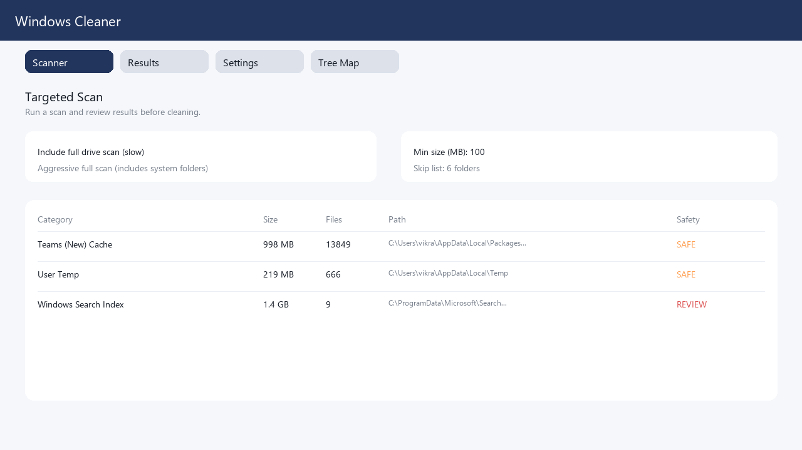
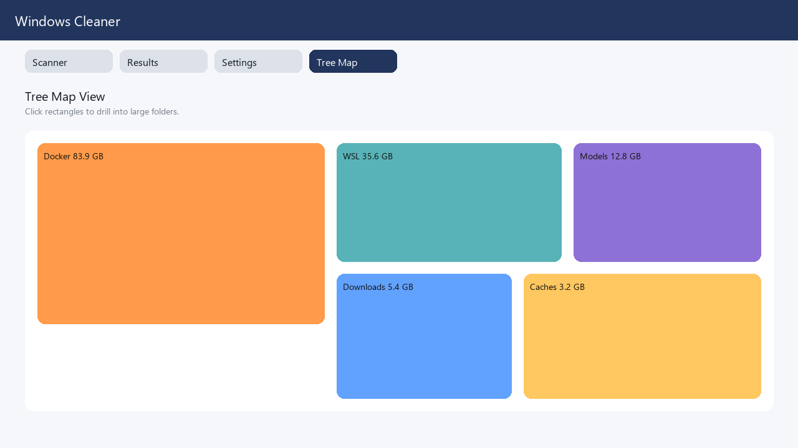

# Windows Cleaner (CLI + GUI)

A Windows-focused cleaner that scans common cache and temp locations on the C drive,
then lets you remove safe targets. It includes a GUI for quick cleanup, a Tree Map
visualizer (TreeSize-style), and a CLI for automation and reporting.

## Features

- Targeted cache cleaning: Teams classic/new, Outlook Secure Temp, Office document cache, Windows temp, user temp.
- Windows Update residuals and Delivery Optimization cache cleanup (admin required).
- Policy profiles (enterprise presets) for standardized cleanup.
- Scheduled cleanups via Windows Task Scheduler.
- Centralized audit reporting (JSONL log + optional sink/HTTP endpoint).
- Full drive scan to surface large folders, with configurable size threshold.
- Tree Map visualization with click-to-zoom and Back navigation.
- Safe vs. Review guardrails to prevent accidental deletion of system/index data.
- Exportable reports and cached last scan.
- Settings for skip lists and scan thresholds.
- Logs for auditing cleanup activity.
- Installer-ready EXE with custom icon support, MSI script, and Start Menu shortcut.

## Screens

- Scanner tab: run targeted scan and optionally include full drive scan.
- Results tab: review targets, open paths, export report, clean SAFE items.
- Settings tab: skip list and scan thresholds.
- Tree Map tab: visual breakdown by size with drill-down navigation.

## Screenshots




## Quick start

```powershell
python cleaner.py scan
python cleaner.py clean --confirm
python cleaner.py gui
```

## Commands

```powershell
python cleaner.py scan [--full] [--aggressive] [--json] [--save-report PATH] [--min-mb 200]
python cleaner.py clean --confirm [--category temp_user --category teams_classic_cache]
python cleaner.py clean --confirm --dangerous
python cleaner.py clean --confirm --dry-run --use-last-scan
python cleaner.py clean --confirm --one-click
python cleaner.py clean --confirm --profile enterprise
python cleaner.py report --path C:\temp\cleaner-report.txt [--full] [--aggressive]
python cleaner.py gui
python cleaner.py profiles --list
python cleaner.py schedule --create --profile enterprise --freq DAILY --time 02:00
python cleaner.py audit --export C:\temp\audit.jsonl
```

## Safety model

- SAFE categories are deletable by default (temp folders, Teams caches, Outlook secure temp).
- REVIEW categories (like Windows Search index data) are blocked unless you pass `--dangerous`.
- The cleaner only removes contents of folders, not the folders themselves.

## One-click cleanup

Use the one-click option to clean temp files plus Teams/Outlook/Office caches and Windows Update residuals in one pass.

```powershell
python cleaner.py clean --confirm --one-click
```

Run as Administrator to include Windows Update and Delivery Optimization caches.

## Policy profiles (enterprise presets)

Profiles define which categories are cleaned in a single run:

- `standard`: temp + Teams + Outlook secure temp
- `enterprise`: standard + Office document cache + Windows Update + Delivery Optimization
- `aggressive`: enterprise + Windows Search index

Use:

```powershell
python cleaner.py clean --confirm --profile enterprise
python cleaner.py profiles --list
```

## Scheduled cleanups

Create a scheduled cleanup task using Task Scheduler:

```powershell
python cleaner.py schedule --create --profile enterprise --freq DAILY --time 02:00
python cleaner.py schedule --list
python cleaner.py schedule --run-now --name "CDriveCleaner - enterprise"
python cleaner.py schedule --delete --name "CDriveCleaner - enterprise"
```

## Centralized audit reporting

Audit events are written to:

`%LOCALAPPDATA%\CDriveCleaner\audit.jsonl`

Optional: add a sink path or HTTP endpoint in the Settings tab, or override via CLI:

```powershell
python cleaner.py clean --confirm --profile enterprise --audit-sink \\server\share\cleaner-audit.jsonl
python cleaner.py clean --confirm --profile enterprise --audit-endpoint https://example.com/cleaner/audit
python cleaner.py audit --export C:\temp\audit.json
```

## Notes

- Full scans can be slow. By default, system folders are skipped unless you use `--aggressive`.
- Some files may be locked by running apps and will be reported as failures.
- The Tree Map tab provides a visual overview similar to TreeSize, with zoomable rectangles.
- One-click cleanup will skip Windows Update/Delivery Optimization caches unless you run as admin.

## App data

The app stores settings, logs, and the last scan cache in:

`%LOCALAPPDATA%\CDriveCleaner`

## One-click launch

Use `run_cleaner_gui.bat` to open the GUI without typing commands.

## Build a Windows app (exe)

```powershell
pip install pyinstaller
pyinstaller cleaner.spec
```

The executable will be in `dist\CDriveCleaner.exe`.

## Add a custom icon

Place a Windows icon at:

`C:\Users\vikra\OneDrive\Documents\Playground\assets\app.ico`

Then rebuild the EXE with PyInstaller.

## Start Menu shortcut

```powershell
PowerShell -ExecutionPolicy Bypass -File installer\create_start_menu_shortcut.ps1
```

## Build MSI installer (WiX Toolset)

1. Install WiX Toolset v3.14+.
2. Build the EXE (see above).
3. Run:

```powershell
PowerShell -ExecutionPolicy Bypass -File installer\build_installer.ps1
```

The MSI will be created at `installer\CDriveCleaner.msi`.
